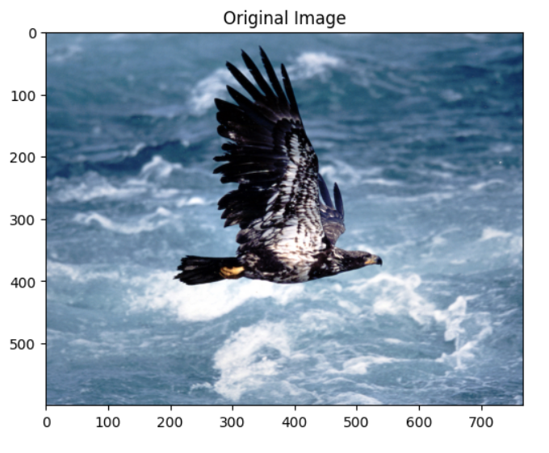
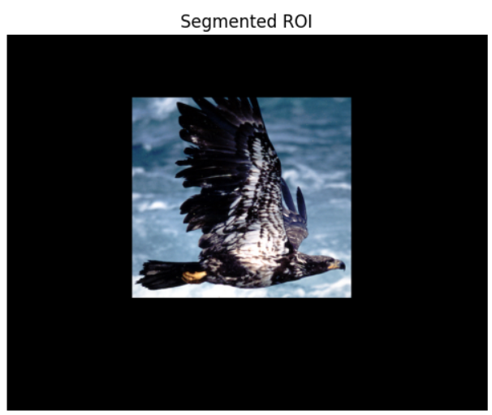
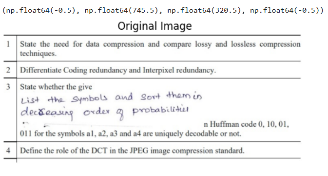
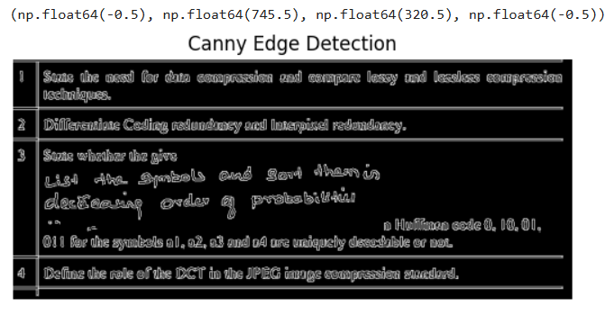
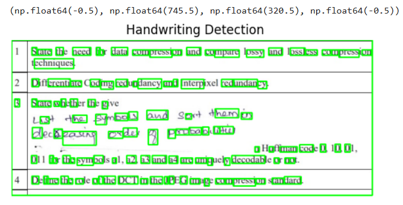
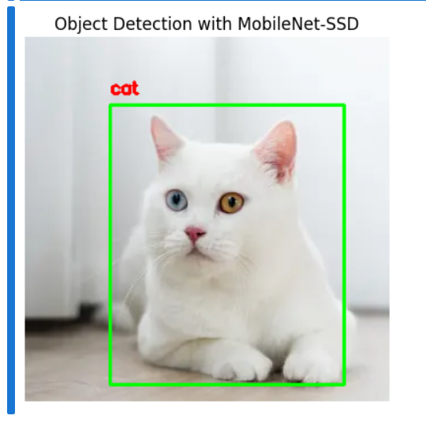

# PROJECT--Face-Detection-with-Haar-Cascades
# Face Detection using Haar Cascades with OpenCV and Matplotlib
## Name : Krithika Lakshmi M
## Reg no : 212224230134

## Aim

To write a Python program using OpenCV to perform the following image manipulations:  
i) Extract ROI from an image.  
ii) Perform face detection using Haar Cascades in static images.  
iii) Perform eye detection in images.  
iv) Perform face detection with label in real-time video from webcam.

## Software Required

- Anaconda - Python 3.7 or above  
- OpenCV library (`opencv-python`)  
- Matplotlib library (`matplotlib`)  
- Jupyter Notebook or any Python IDE (e.g., VS Code, PyCharm)

## Algorithm

### I) Load and Display Images

- Step 1: Import necessary packages: `numpy`, `cv2`, `matplotlib.pyplot`  
- Step 2: Load grayscale images using `cv2.imread()` with flag `0`  
- Step 3: Display images using `plt.imshow()` with `cmap='gray'`

### II) Load Haar Cascade Classifiers

- Step 1: Load face and eye cascade XML files 
### III) Perform Face Detection in Images

- Step 1: Define a function `detect_face()` that copies the input image  
- Step 2: Use `face_cascade.detectMultiScale()` to detect faces  
- Step 3: Draw white rectangles around detected faces with thickness 10  
- Step 4: Return the processed image with rectangles  

### IV) Perform Eye Detection in Images

- Step 1: Define a function `detect_eyes()` that copies the input image  
- Step 2: Use `eye_cascade.detectMultiScale()` to detect eyes  
- Step 3: Draw white rectangles around detected eyes with thickness 10  
- Step 4: Return the processed image with rectangles  

### V) Display Detection Results on Images

- Step 1: Call `detect_face()` or `detect_eyes()` on loaded images  
- Step 2: Use `plt.imshow()` with `cmap='gray'` to display images with detected regions highlighted  

### VI) Perform Face Detection on Real-Time Webcam Video

- Step 1: Capture video from webcam using `cv2.VideoCapture(0)`  
- Step 2: Loop to continuously read frames from webcam  
- Step 3: Apply `detect_face()` function on each frame  
- Step 4: Display the video frame with rectangles around detected faces  
- Step 5: Exit loop and close windows when ESC key (key code 27) is pressed  
- Step 6: Release video capture and destroy all OpenCV windows  

## Program :
```py
import cv2
import numpy as np
import matplotlib.pyplot as plt

image = cv2.imread('Qno. 1.jpg')  
image_rgb = cv2.cvtColor(image, cv2.COLOR_BGR2RGB)

plt.imshow(image_rgb)
plt.title("Original Image")
plt.axis('on')
plt.show()

roi = image[100:420, 200:550]  

mask = np.zeros_like(image)

mask[100:420, 200:550] = roi

segmented_roi = cv2.bitwise_and(image, mask)

segmented_roi_rgb = cv2.cvtColor(segmented_roi, cv2.COLOR_BGR2RGB)
plt.imshow(segmented_roi_rgb)
plt.title("Segmented ROI")
plt.axis('off')
plt.show()

import cv2
import numpy as np
import matplotlib.pyplot as plt

image = cv2.imread('your_image_1.jpg')  
image_rgb = cv2.cvtColor(image, cv2.COLOR_BGR2RGB) 

plt.imshow(image_rgb)
plt.title("Original Image")
plt.axis('off')

gray_image = cv2.cvtColor(image, cv2.COLOR_BGR2GRAY) 

blurred_image = cv2.GaussianBlur(gray_image, (5, 5), 0)

edges = cv2.Canny(blurred_image, 50, 150)

plt.imshow(edges, cmap='gray')
plt.title("Canny Edge Detection")
plt.axis('off')

contours, _ = cv2.findContours(edges, cv2.RETR_EXTERNAL, cv2.CHAIN_APPROX_SIMPLE)

result_image = image.copy()  
for contour in contours:
    if cv2.contourArea(contour) > 50:  
        x, y, w, h = cv2.boundingRect(contour)  
        cv2.rectangle(result_image, (x, y), (x + w, y + h), (0, 255, 0), 2) 

plt.imshow(cv2.cvtColor(result_image, cv2.COLOR_BGR2RGB))
plt.title("Handwriting Detection")
plt.axis('off')

import cv2
import numpy as np
import matplotlib.pyplot as plt

config_file = 'deploy.prototxt'  
weights = 'mobilenet_iter_73000.caffemodel'

net = cv2.dnn.readNetFromCaffe(config_file, weights)

class_labels = {0: 'background', 1: 'aeroplane', 2: 'bicycle', 3: 'bird', 4: 'boat',
                5: 'bottle', 6: 'bus', 7: 'car', 8: 'cat', 9: 'chair', 10: 'cow', 11: 'diningtable',
                12: 'dog', 13: 'horse', 14: 'motorbike', 15: 'person', 16: 'pottedplant', 17: 'sheep',
                18: 'sofa', 19: 'train', 20: 'tvmonitor'}

image = cv2.imread('download.webp')  
(h, w) = image.shape[:2]

image_rgb = cv2.cvtColor(image, cv2.COLOR_BGR2RGB)

blob = cv2.dnn.blobFromImage(image, 0.007843, (300, 300), 127.5)

net.setInput(blob)
detections = net.forward()

for i in range(detections.shape[2]):
    confidence = detections[0, 0, i, 2]

    if confidence > 0.5:  
        index = int(detections[0, 0, i, 1]) 
        label = class_labels[index]  
        box = detections[0, 0, i, 3:7] * np.array([w, h, w, h])
        (startX, startY, endX, endY) = box.astype("int")

        cv2.rectangle(image_rgb, (startX, startY), (endX, endY), (0, 255, 0), 2)
        cv2.putText(image_rgb, label, (startX, startY - 10), cv2.FONT_HERSHEY_SIMPLEX, 0.5, (255, 0, 0), 2)

plt.imshow(image_rgb)
plt.title("Object Detection with MobileNet-SSD")
plt.axis("off")
plt.show()

```

## Output :













## Result :

Thus, to write a Python program using OpenCV to perform image manipulations for the given objectives is executed sucessfully.